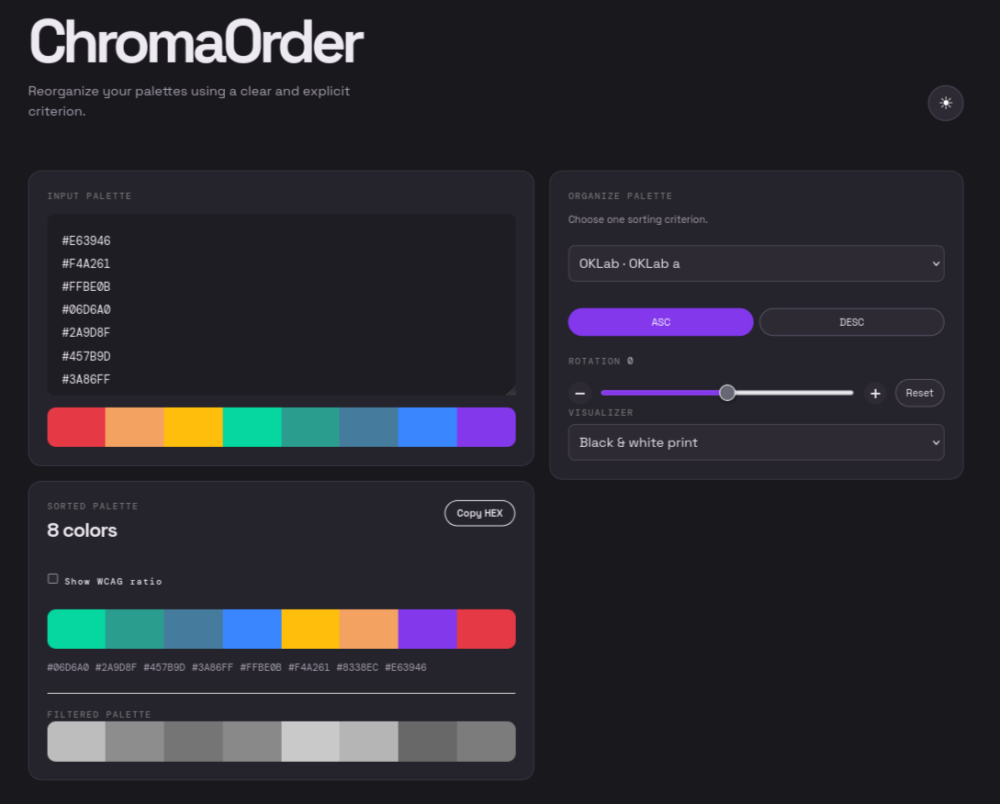

# ChromaOrder

Client-side color palette sorting and analysis tool. The color engine is
independent from React and preserves the original index for stable sorting.


---



## Development

All development commands run through Docker Compose:

```sh
just docker-build   # Build the development image
just dev            # http://localhost:5173
just test           # Run Vitest tests
just build          # Build the Vite application
just precommit-install # Install pre-commit hooks
just precommit-test # Run all pre-commit hooks
just prod           # Production preview at http://localhost:8080
just down           # Stop containers
```

`just precommit-install` configures the repository hooks in `.githooks`.
Pre-commit then runs in the dedicated Docker Compose `precommit` service. It
formats Markdown, CSS, JavaScript and TypeScript files with Prettier, and checks
trailing whitespace and end-of-file newlines. No host installation is required.

Production uses the Compose `production` profile and serves the Vite build with
Nginx.

## Features

- Stable single-criterion sorting with ascending/descending direction.
- HEX, RGB, HSL, HSV, CIELAB, OKLab and OKLCH analysis.
- Photo-filter previews with RGB and combined-color filters.
- WCAG contrast ratios with a configurable foreground color.
- Palette rotation, color inspector, dark mode and print styles.
